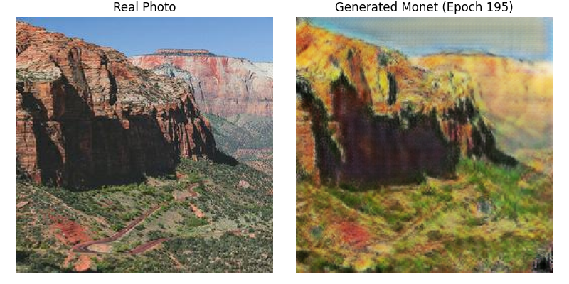
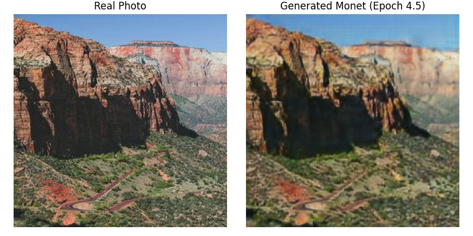

# Perceptual Loss Experiment
After building and testing our MonetGAN model, we hypothesized that adding high-level artistic details, such as brushstroke marks, could further improve the stylization of the generated Monet-like paintings. 
To test this, we explored the addition of a perceptual loss function, leveraging a pretrained VGG-19 model to extract high-level feature maps from real Monet paintings. The goal was for the generator to match the feature representations of these paintings in the VGG network's intermediate layers, which would ideally help capture finer, more abstract stylistic high level details.
## Visual Results
| No Perceptual Loss | Perceptual Loss (VGG_lambda = 1) |
|:-----------------------------:|:--------------------------------:|
|        |    |
## FID Score
## Conclusion
We initially expected perceptual loss to improve stylization, but the results showed otherwise. As seen in the left image, adding perceptual loss actually made the generated painting look more realistic. This likely happened because the VGG-19 model, which the loss is based on, was trained on real-world photos and tends to emphasize photo-realistic features rather than painterly styles.
