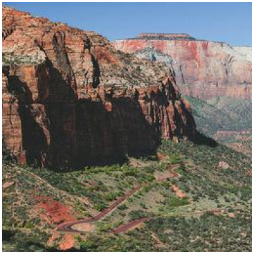
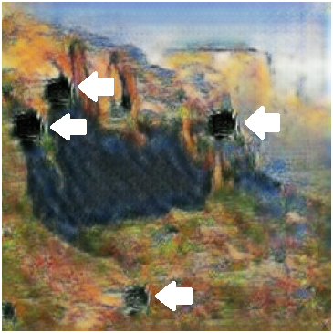
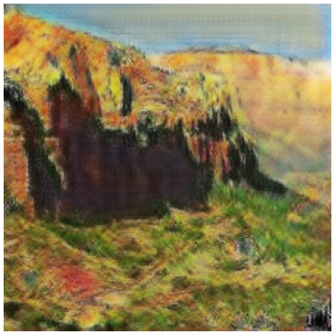
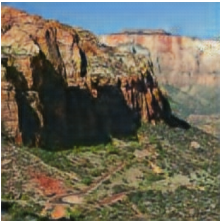

# MonetGAN - Monet-Style Painting Generation
This repository contains an implementation of a Generative Adversarial Network (GAN) aimed at transforming photos into Monet-style paintings. The model was developed for the MonetGAN challenge on Kaggle.
The goal of the challenge was to use a GAN to take input photos and generate Monet-style paintings. The challenge serves as an excellent introduction to GANs and image-to-image translation tasks.
## Installation
- Python 3.x
- PyTorch 1.x
- torchvision
- tqdm
- matplotlib
- Pillow

To install the dependencies, you can create a virtual environment and install the requirements using the following command:
```bash
pip install -r requirements.txt
```
### Clone the Repository
```bash
git clone https://github.com/igoldshm/MonetGAN
```
## Challenges
We trained our model using the Monet/Photo dataset from Kaggle. During preprocessing, we observed a significant imbalance between the number of real-world photos (7,028) and Monet-style paintings (300). This imbalance can affect the performance of the model by making the photo discriminator disproportionately strong (as it being trained on more samples). As a result, the training of the Monet-to-photo generator may suffer, and the effectiveness of the cycle consistency loss can be reduced, since the network struggles to maintain a balanced bidirectional mapping.
###  Solution
To mitigate the effects of the imbalanced dataset, we applied a balanced strategy that combines the following techniques:
- Data augmentation on the Monet dataset to increase visual diversity and reduce overfitting
- Oversampling of Monet paintings to match the number of photo samples
- Balanced batch sampling, ensuring each training batch contains an equal number of photos and Monet-style images

## Model
In this project we used CycleGAN as our base architecture.
### Generator  implementation
In CycleGAN, there are two generators: one that converts real photos into fake Monet-style paintings (photo → Monet), and another that performs the reverse (Monet → photo). Both generators have the same architecture, consisting of an encoder and a decoder. Between them, after the encoder downsamples the input image into a lower-resolution feature map, there are 9 ResNet blocks that refine this feature map. These blocks help preserve spatial information while transforming the style and content, preparing it for reconstruction by the decoder.
### Discriminator  implementation
### Loss calculation
#### Generator loss
The generator loss is the sum of four different losses:
- Adversarial loss - the aim of the generator is to fool the discriminator -> pred(fake monet)=1 (MSELoss)
- Identity loss - Monet → Monet should remain unchanged (L1Loss)
- Cycle Consistency Loss - Loss for reconstructing photo from fake Monet. Real → Monet → Real (L1Loss)
- Perceptual Loss – Developed a customized CycleGAN model integrated with a perceptual loss function based on a pretrained VGG19 architecture, enhancing the model’s ability to preserve high-level features during style transfer (such as brush strokes), in contrast to the lower-level pixel comparisons performed by identity, cycle-consistency, and adversarial losses.
##### LAMBDA optimization
- We have been expirimenting with different values for the weights of each loss (LAMBDA) to get the best visual outcome. See  and .
#### Discriminator loss
The discriminator loss is the adversarial loss - pred(fake monet)=0 (MSELoss)
## Training
- Generator optimizer: Adam
- Discriminator optimizer: Adam
- Learning rate: 0.0002 (learining rate decay after 100 epochs)
- Epochs = 200
- LAMBDA_CYCLE = 1  (Weight for cycle consistency loss)
- LAMBDA_IDENTITY = 1  (Weight for identity loss)

## Results
### Loss function tunning
### Identity loss weight (lambda)
In our project, we experimented with different identity loss lambda values to find the optimal setting for the best visual results. We observed that increasing the lambda value caused the generated samples to resemble the original images from domain A more closely, while decreasing it produced outputs that were more stylized and resembled Monet paintings (domain B). This behavior aligned with the general assumption about the role of the identity loss function, to prevent over-stylizing an input image if it is already in the correct target domain.

### **Results Preview**
| Real Photo | Identity lambda = 0.5 |
|:-----------------------------:|:--------------------------------:|
|       |    |

| Identity lambda = 1.5 | Identity lambda = 4.5 |
|:-----------------------------:|:--------------------------------:|
|        |    |

⚠️ Low Identity Lambda Warning

Setting identity_lambda = 0.5 is insufficient to preserve structural details during training.
This results in image degradation, visible as black blobs or structure collapse (see white arrows in the right top image, lambda = 0.5).
The generator ignores the original image's structure or key features and replaces those areas with "safe" pixels that can fool the discriminator more easily.

Conclusion

After testing various values, we found that the best visual results were achieved when the identity loss weight, lambda_identity, was set to 1.5.

## License
This project is licensed under the MIT License.
## Acknowledgments
- The CycleGAN model is based on the paper Unpaired Image-to-Image Translation using Cycle-Consistent Adversarial Networks (https://arxiv.org/abs/1703.10593).
- Special thanks to the contributors of the PyTorch library and other open-source tools that made this project possible.
- Thanks to the MonetGAN challenge on Kaggle for providing an engaging way to learn and experiment with GANs

